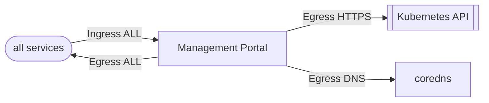

The FluxCD Configuration for [Cert Manager](https://cert-manager.io/). Cert Manager is a powerful and extensible X.509 certificate controller for Kubernetes and OpenShift workloads. It will obtain certificates from a variety of Issuers, both popular public Issuers as well as private Issuers, and ensure the certificates are valid and up-to-date, and will attempt to renew certificates at a configured time before expiry.

This will also install [Trust Manager](https://cert-manager.io/docs/trust/). Trust Manager is used to distribute trusted certificates to the various pods so that they might be used.

## Network Policies

| Direction | Ports/Type | Description |
| --- | --- | --- |
| Ingress | All | Allows all traffic inbound. TODO: This needs to be refined |
| Egress | All | Allows all traffic to egress. TODO: This needs to be refined |
| Egress | TCP/UDP 53 | Allows traffic for DNS ports |
| Egress | HTTPS | Allows access to the kubernetes service to allow Kubernetes API Access |